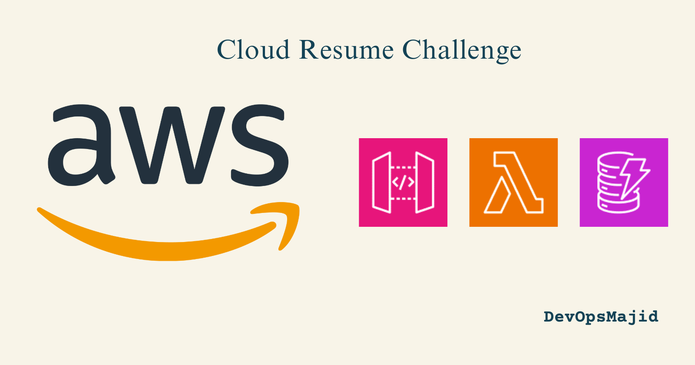
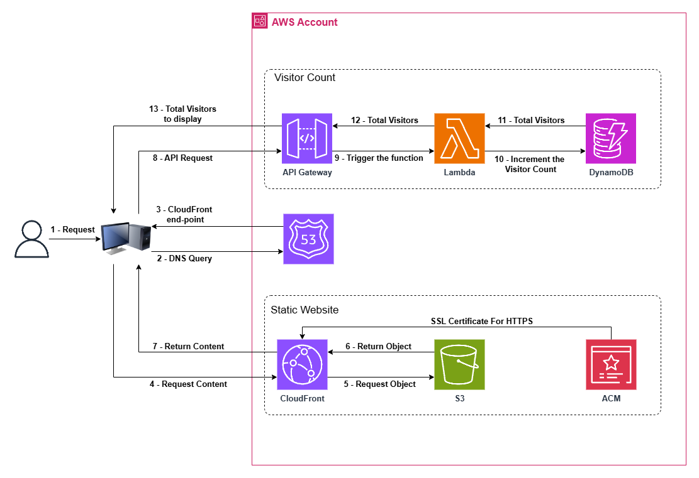

# Cloud Resume Challenge Part 2 - Visitor Traffic Tracking
Take your cloud resume to the next level in Part 2 of the Cloud Resume Challenge. If you're catching up, start with [Part 1](https://devopsmajid.hashnode.dev/cloud-resume-challenge-part-1) where we set up a static website on AWS. Now, let's track how many visitors our resume attracts by leveraging AWS Lambda and DynamoDB!

You'll find a complete guide on my [blog post](https://devopsmajid.hashnode.dev/cloud-resume-challenge-part-2).

Welcome to Part 2 of the Cloud Resume Challenge. This repository adds a visitor count feature. We will create and interact with a DynamoDB table using AWS Lambda, and connect everything using API Gateway.
Automate and showcase your visitor count feature without hassle by following these simple steps:

## Architecture

The architecture for this setup is detailed below:

This second part of the Challenge involves creating a back-end for the visitor count using AWS services: 
- AWS Lambda function for logic handling
- DynamoDB for storing visitor counts
- API Gateway to trigger Lambda function from the frontend
## Prerequisites

- AWS account with permissions to work with DynamoDB, Lambda, and API Gateway.
- Terraform already set up and ready to go.

## How to Use

1. Execute `script_lunch.sh`.
2. During the first run, if prompted `"To use an AWS profile, enter the profile name (or type 'none' to specify Access Keys instead):"`, you can enter the AWS [profile](https://docs.aws.amazon.com/cli/latest/userguide/cli-configure-files.html) name if available. If not, type 'none' and provide `aws_access_key_id` and `aws_secret_access_key`.

3. Follow the prompts to enter your preferred region and any other required AWS configurations as requested by the script.

4. Wait approximately 6 minutes for your website to be live.

When you see the end-point of the API Gateway, you're all set to test it and if the count increments.

To clean up all resources, run `script_destroy.sh` from the root of your folder. Ensure it reads `"Terraform destroying infrastructure"` to verify successful deletion of resources.

To reset all variables, run `script_reset.sh` from the root of your folder.

